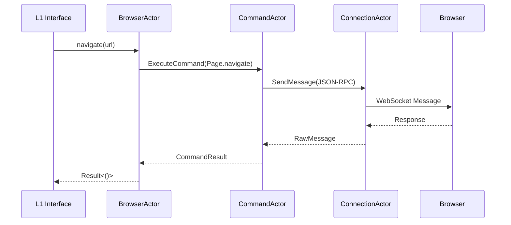
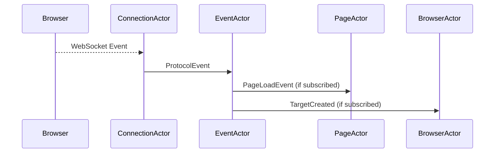

# Janus Client Core Actors Design Specification

**Location**: `janus-client/docs/design/ACTORS.md`
**Purpose**: Detailed documentation of key actors in Janus Client's architecture.

---

## 1. Overview
This document provides in-depth specifications for the core actors in Janus Client's actor system. Each actor's responsibilities, state, message protocol, and interaction patterns are defined here.

---

## 2. Core Actors

### 2.1 Supervisor Actor
**Layer**: Core
**Instance**: Singleton (per process)

#### Responsibilities
- **Lifecycle Management**
  - Bootstraps the actor system on first browser launch
  - Orchestrates graceful shutdown of all actors
- **Error Handling**
  - Implements supervision strategies (restart/stop/escalate)
  - Logs critical failures and attempts recovery
- **Resource Monitoring**
  - Tracks actor mailbox sizes and health status
  - Triggers alerts when thresholds exceeded

#### State
```rust
struct SupervisorState {
    children: HashMap<ActorType, Vec<Addr<dyn Actor>>>,
    restart_policies: HashMap<ActorType, RestartPolicy>,
    system_metrics: SystemMetrics,
}
```

#### Key Messages
| Message Type          | Direction           | Purpose                          |
|-----------------------|---------------------|----------------------------------|
| `RegisterActor`       | Child → Supervisor  | New actor registration           |
| `ActorFailed`         | Framework → Supervisor | Handle child actor failure     |
| `SystemShutdown`      | External → Supervisor | Initiate graceful shutdown    |

---

### 2.2 Browser Actor
**Layer**: L2 (Browser Implementation)
**Instance**: One per browser instance

#### Responsibilities
- **Instance Management**
  - Handles browser process launch/termination (local mode)
  - Manages WebSocket connection lifecycle (remote mode)
- **Protocol Coordination**
  - Translates L1 `Browser` trait calls to protocol commands
  - Maintains browser-level sessions (CDP's `Browser` domain)
- **Page Orchestration**
  - Creates/destroys `PageActor` instances
  - Routes global events to interested parties

#### State
```rust
struct BrowserState {
    connection_state: ConnectionState,
    pages: HashMap<TargetId, PageHandle>,
    browser_specific: BrowserSpecificState, // e.g., ChromeSessionInfo
    pending_commands: Vec<CommandMeta>,
}
```

#### Key Messages
| Message Type          | Direction           | Purpose                          |
|-----------------------|---------------------|----------------------------------|
| `CreatePage`          | L1 → BrowserActor   | Initiate new page creation       |
| `PageEvent`           | EventActor → BrowserActor | Handle browser-level events  |
| `ProtocolCommand`     | BrowserActor → CommandActor | Execute browser-scoped commands |

---

### 2.3 Page Actor
**Layer**: L2 (Browser Implementation)
**Instance**: One per browser tab/target

#### Responsibilities
- **Page Lifecycle**
  - Manages navigation state (Loading/Interactive/Complete)
  - Handles target detachment/crashes
- **DOM Interaction**
  - Coordinates DOM queries and modifications
  - Maintains element handle mappings
- **Execution Context**
  - Manages JavaScript execution contexts
  - Handles console messages and exceptions

#### State
```rust
struct PageState {
    target_id: TargetId,
    navigation_status: NavigationStatus,
    execution_contexts: Vec<ExecutionContext>,
    element_store: ElementRegistry,
    event_subscriptions: HashSet<EventType>,
}
```

#### Key Messages
| Message Type          | Direction           | Purpose                          |
|-----------------------|---------------------|----------------------------------|
| `Navigate`            | L1 → PageActor      | Initiate page navigation         |
| `EvaluateJS`          | L1 → PageActor      | Execute JavaScript               |
| `DOMEvent`            | EventActor → PageActor | Handle page-specific DOM events |

---

### 2.4 Connection Actor
**Layer**: L3 (Transport)
**Instance**: One per active connection

#### Responsibilities
- **Transport Management**
  - Handles WebSocket/TCP connection lifecycle
  - Implements protocol message framing
- **Flow Control**
  - Manages write backpressure
  - Enforces message size limits
- **Reconnection**
  - Implements retry logic with exponential backoff

#### State
```rust
struct ConnectionState {
    transport: Box<dyn Transport>,
    status: ConnectionStatus,
    config: ConnectionConfig,
    message_queue: VecDeque<String>,
}
```

#### Key Messages
| Message Type          | Direction           | Purpose                          |
|-----------------------|---------------------|----------------------------------|
| `RawMessage`          | ConnectionActor → Upstream | Forward received messages    |
| `SendMessage`         | Downstream → ConnectionActor | Send outgoing messages      |
| `ConnectionStatus`    | ConnectionActor → Supervisor | Report connection health   |

---

### 2.5 Command Actor
**Layer**: Core
**Instance**: Typically one per browser instance

#### Responsibilities
- **Command Execution**
  - Generates unique request IDs
  - Formats protocol-specific messages
- **Response Handling**
  - Matches responses to pending requests
  - Manages command timeouts
- **Protocol Translation**
  - Converts between L2 abstractions and wire format

#### State
```rust
struct CommandState {
    pending_commands: HashMap<RequestId, PendingCommand>,
    protocol_adapter: Box<dyn ProtocolAdapter>,
    sequence_id: AtomicU64,
}
```

#### Key Messages
| Message Type          | Direction           | Purpose                          |
|-----------------------|---------------------|----------------------------------|
| `ExecuteCommand`      | Caller → CommandActor | Request protocol command       |
| `CommandResponse`     | ConnectionActor → CommandActor | Handle browser response     |

---

### 2.6 Event Actor
**Layer**: Core
**Instance**: Typically one per browser instance

#### Responsibilities
- **Event Routing**
  - Maintains subscription registry
  - Distributes events to interested actors
- **Event Buffering**
  - Provides event replay for late subscribers
  - Implements event filtering
- **Protocol Normalization**
  - Converts protocol-specific events to common format

#### State
```rust
struct EventState {
    subscriptions: HashMap<EventType, Vec<Subscriber>>,
    event_buffer: VecDeque<BufferedEvent>,
    filter_rules: Vec<EventFilter>,
}
```

#### Key Messages
| Message Type          | Direction           | Purpose                          |
|-----------------------|---------------------|----------------------------------|
| `Subscribe`           | Subscriber → EventActor | Register interest in events  |
| `ProtocolEvent`       | ConnectionActor → EventActor | Process raw browser event   |

---

## 3. Interaction Patterns

### 3.1 Command Flow


### 3.2 Event Flow


---

## 4. Error Handling Matrix

| Actor            | Expected Errors                  | Recovery Strategy                     |
|------------------|----------------------------------|---------------------------------------|
| **Supervisor**   | Child actor panic               | Apply restart policy (max 3 retries)  |
| **BrowserActor** | Process launch failure          | Return error to L1, enter Dead state  |
| **PageActor**    | Target detached                 | Notify parent, clean up resources    |
| **Connection**   | WebSocket disconnect           | Exponential backoff reconnect        |
| **Command**      | Protocol response timeout      | Cancel pending futures, notify caller |

---

## 5. Performance Considerations

1. **Mailbox Sizing**
   - BrowserActor: 1000+ slots (high throughput)
   - PageActor: 100-300 slots (per-tab isolation)
   - CommandActor: Unbounded (prevent command drops)

2. **Actor Placement**
   - Browser/Page actors: Distributed across threads
   - Command/Event actors: Collocated for cache locality

3. **Message Design**
   - Use `Arc` for large payloads (e.g., screenshot bytes)
   - Prefer batch messages for DOM operations

---

## 6. Extension Points

1. **Custom Actors**
   ```rust
   trait PluginActor: Actor<Context = Context<Self>> {
       fn handle_protocol_event(&mut self, event: PluginEvent);
   }
   ```

2. **Protocol Adapters**
   ```rust
   pub trait ProtocolAdapter {
       fn to_wire(&self, cmd: Command) -> Result<String>;
       fn from_wire(&self, msg: &str) -> Result<Event>;
   }
   ```

---

**Revision History**
- v0.1 (2023-11-20): Initial version covering core actors
